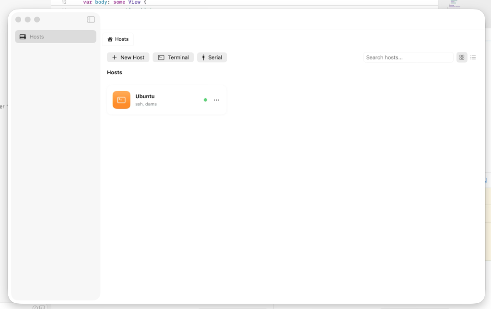

# OpenTerm SSH

OpenTerm SSH is an open source SSH/SFTP client project built around a reusable C core on top of vendored `libssh`.



Current vendored `libssh` version: `0.11.3`

## What This Project Is

OpenTerm SSH is a personal SSH client project focused on:

- a reusable SSH/SFTP core in C
- a macOS-first app layer in SwiftUI
- a clean separation between the transport/core layer and future platform UIs
- experimenting with ideas commonly seen in modern SSH clients

This project is inspired by the general experience and feature direction of other SSH clients, but it is its own independent implementation.

## Current Scope

Today the project includes:

- SSH connections with strict host key verification by default
- password, public key, and keyboard-interactive authentication support
- SFTP support in the core
- a macOS app in active development
- a reusable C core intended to support future platform layers
- a manual CLI tool for smoke testing and debugging

## Project Status

This is an experimental project for learning, exploration, and personal use.

It is not a production-ready SSH client yet.

You should expect:

- incomplete features
- implementation changes
- bugs
- rough edges
- possible security issues or other vulnerabilities

I do not recommend using this project for professional, business-critical, or security-sensitive workloads until it reaches a clearly stable release.

This is not a project I am working on full-time. My main focus is on other projects, and this repository is developed in my spare time for experimentation and entertainment while sharing progress publicly.

## Architecture

```text
libssh + OpenSSL
-> openterm_core (C)
-> platform UI layers
```

## Repository Layout

```text
term/
├── core/
├── platforms/
├── scripts/
├── tools/
├── tests/
├── vendor/
└── dist/
```

## Build Paths

Current build paths in this repository:

- shared core build with CMake
- macOS app build through `dist/OpenTermCore.xcframework`

Dependency contracts today:

- the general core build uses `vendor/libssh`
- the supported macOS app build uses Apple-native artifacts under `vendor/apple/`

The supported macOS app path is `./scripts/build_macos_app.sh`.

## Minimum Requirements

| Tool | Purpose |
|------|---------|
| CMake 3.20+ | Core build system |
| Git | Source management |
| C compiler | `gcc`, `clang`, or MSVC-compatible toolchain |

## Build The Core

Check requirements:

```bash
./scripts/check-requirements.sh
```

Build:

```bash
./scripts/build.sh
```

## Manual CLI Smoke Test

The manual CLI lives in `tools/` and is meant for smoke testing and debugging, not as the main product surface.

Example:

```bash
cd core/build
./openterm_cli <host> <user> "ls -la"
```

It will try default private keys from `~/.ssh/` (`id_ed25519`, `id_ecdsa`, `id_rsa`).

It also supports explicit flags such as:

```bash
./openterm_cli --host example.com --user alice --command "uname -a" --port 22
./openterm_cli --host example.com --user alice --key ~/.ssh/id_ed25519
```

## macOS App

Official macOS build path:

1. build Apple OpenSSL artifacts
2. build Apple `libssh` artifacts
3. generate `dist/OpenTermCore.xcframework`
4. build the Swift package in `platforms/macos/`

Recommended command:

```bash
./scripts/build_macos_app.sh
```

Explicit step-by-step path:

```bash
./scripts/build_apple_openssl.sh
./scripts/build_apple_libssh.sh
./scripts/build_apple_xcframework.sh
swift build --package-path platforms/macos
```

Prerequisites:

- Xcode / Swift toolchain with macOS support
- Apple dependency artifacts prepared under `vendor/apple/`
- Apple Silicon (`arm64`) Mac
- OpenSSL remains part of the native dependency chain and matters for license/compliance review when distributing binaries

Important:

- `platforms/macos/Package.swift` depends on `dist/OpenTermCore.xcframework`
- if that artifact does not exist yet, the package will fail explicitly
- the official Apple-platform path in this repo is currently centered on the macOS app, not iOS
- the supported macOS build target is Apple Silicon (`arm64`) only
- the Apple dependency path uses prepared artifacts under `vendor/apple/`, generated from sources under `vendor/sources/`

## Tests

Automated core tests live in `core/tests/`.

The manual CLI lives in `tools/`.

## Licensing

- Project code: MIT License, see [LICENSE](LICENSE)
- Third-party dependencies and notices: see [THIRD_PARTY_NOTICES.md](THIRD_PARTY_NOTICES.md)
- OpenSSL remains part of the shipped/native dependency story, so binary distribution should review its license and notices in addition to `libssh`

## FAQ

### Is this ready for professional use?

No. Treat it as an experimental project until there is a stable release with a clearer security and distribution story.

### Can I distribute it?

Yes, with conditions. If you distribute binaries, you must comply with the MIT License and with the licenses and notices of bundled or linked dependencies (e.g. OpenSSL and libssh).

### Can I publish it in an app store?

Yes, the MIT license allows distribution in app stores. However, you must ensure your distribution method satisfies the LGPL v2.1 requirements of the `libssh` dependency (e.g., providing source code or object files allowing relinking).
